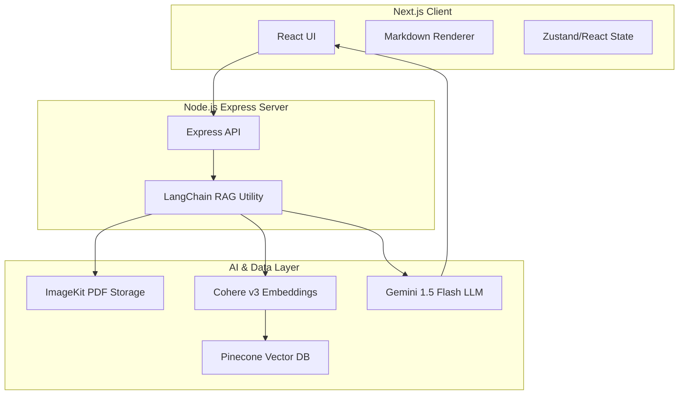
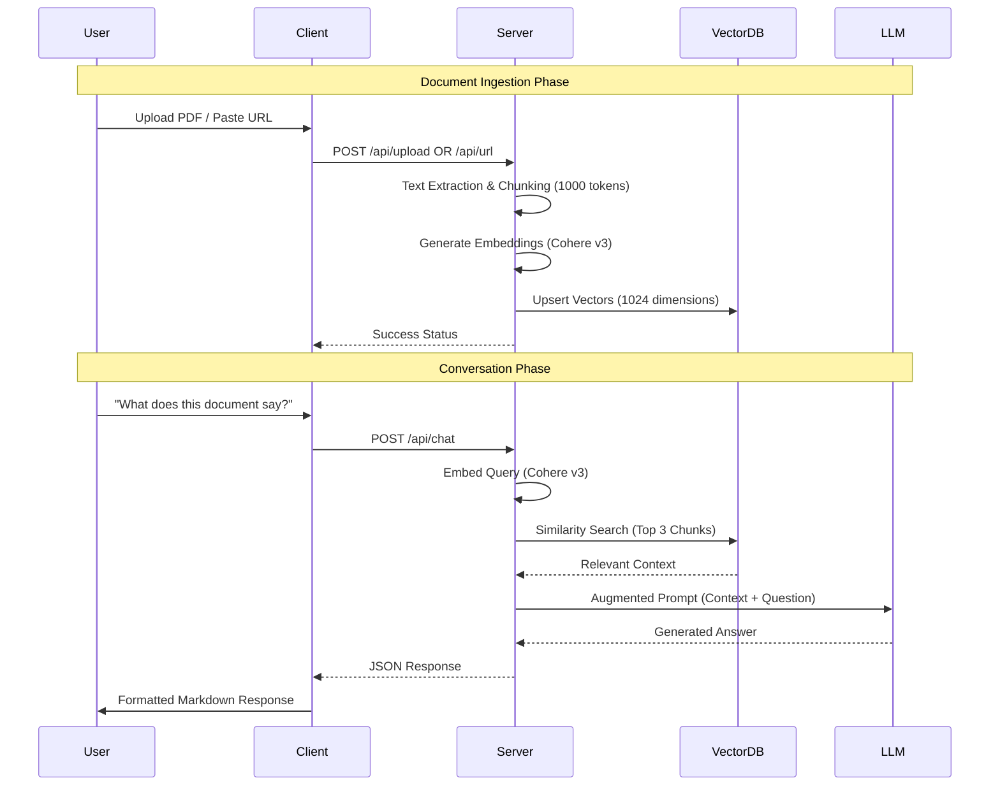

# 🚀 DocuChat Technical Walkthrough

DocuChat is a sophisticated RAG (Retrieval-Augmented Generation) application that bridges the gap between static documents/web content and conversational AI.

## 📐 System Architecture

DocuChat follows a decoupled Client-Server architecture:

## 🔄 The RAG Flow

When you interact with DocuChat, the following "Excalidraw-style" flow occurs:

## 🛠 Key Enhancements Made

- **Markdown Support**: Added `react-markdown` to render AI responses with full formatting (lists, bold, headers).
- **Session Management**: Implemented `Reset` (local) and `Reset DB` (global Pinecone wipe) features.
- **Model Optimization**: Tuned for **Cohere `embed-english-v3.0`** with specific `search_document` input types for 1024-dim retrieval.
- **Favicon Integration**: Custom branding with the DocuChat logo.
